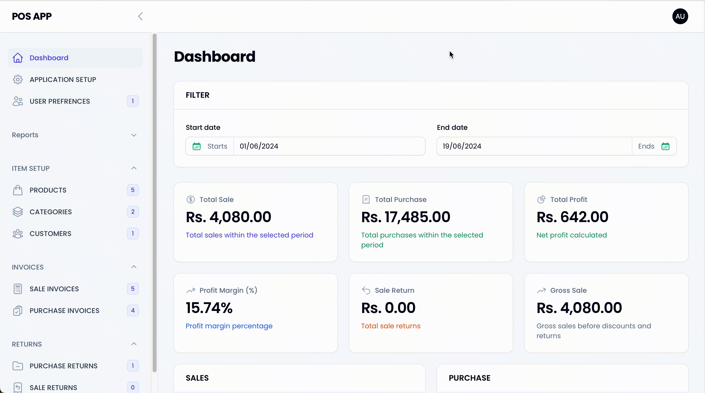

# Laravel Filament POS

A point-of-sale (POS) application built with Laravel and Filament.

## Table of Contents
- [Installation](#installation)
- [Setup](#setup)
- [Key Features](#key-features)
- [Contributing](#contributing)
- [License](#license)

## Installation

1. **Clone the repository:**
    ```bash
    git clone https://github.com/shzdasim/laravel-filament-pos.git
    cd laravel-filament-pos
    ```

2. **Install dependencies:**
    ```bash
    composer install
    npm install
    npm run dev
    ```

3. **Copy the `.env` file:**
    ```bash
    cp .env.example .env
    ```

## Setup

1. **Generate the application key:**
    ```bash
    php artisan key:generate
    ```

2. **Set up the database:**
    - Update the `.env` file with your database credentials:
        ```plaintext
        DB_CONNECTION=mysql
        DB_HOST=127.0.0.1
        DB_PORT=3306
        DB_DATABASE=your_database_name
        DB_USERNAME=your_username
        DB_PASSWORD=your_password
        ```

3. **Run migrations and seed the database:**
    ```bash
    php artisan migrate
    php artisan db:seed
    php artisan db:seed --class=PermissionsSeeder
    ```

4. **Serve the application:**
    ```bash
    php artisan serve
    ```

## Key Features

### Application Setup
An intuitive setup process to get the application up and running quickly.


### Dashboard
An intuitive dashboard providing quick access to key metrics such as total sales, total purchases, inventory status, and recent transactions. Visualize data through graphs and charts for better insights.


### User Management
Manage users with different permissions rather than roles. Admins can create, update, and delete user accounts, and assign specific permissions to control access to various parts of the application. Permissions include:
- Create, Edit, Delete, and View for Applications, Users, SaleInvoices, PurchaseInvoices, Products, Categories, Suppliers, Customers, SaleReturns, and PurchaseReturns.


### Product Management
Add, update, and remove products from the inventory. Manage product details including name, SKU, price, and stock levels. Organize products into categories for better management.


### Sales Management
Handle sales transactions efficiently. Generate sales invoices for customer purchases, apply discounts, and manage payment methods. Track sales history and customer information.


### Purchase Management
Manage purchase orders and supplier interactions. Create and update purchase invoices when stocking up inventory from suppliers. Track purchase history and supplier information.


### Sales Return
Process returns from customers. Generate sales return invoices to manage and track returned products and issue refunds or store credits.


### Purchase Return
Handle returns to suppliers. Generate purchase return invoices for products returned to suppliers due to defects or other reasons.


### Reporting
Generate comprehensive reports for sales, purchases, inventory levels, and returns. Use these reports to analyze business performance and make informed decisions.


### Suppliers Management
Manage supplier information and interactions efficiently.


### Customer Management
Keep track of customer details and purchase history.



### Categories Management
Organize products into categories for easier management and navigation.


### Print Sale Invoice
Print invoices for sales transactions to provide customers with receipts.


### Login
Secure login process for accessing the application.


## Contributing

Contributions are welcome! Please fork this repository and submit pull requests.

## License

This project is licensed under the MIT License.
